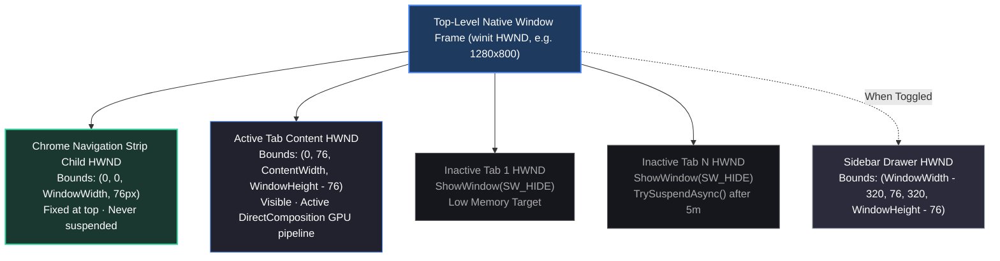

<div align="center">
  
  <p><strong>Lightweight, high-performance Windows desktop browser shell powered by the OS-maintained WebView2 Runtime.</strong><br>
  Direct Win32 HWND composition, ephemeral zero-residue browsing, and native Fluent dark setup wizard.</p>

  <p>
    <a href="dist/EvergreenBrowserSetup.exe"></a>
  </p>

  <p>
    <a href="LICENSE"></a>
    
    
    
    
  </p>
</div>

---

## Table of Contents

- [Why Evergreen](#why-evergreen)
- [Architecture Brief](#architecture-brief)
- [Key Features](#key-features)
- [Performance Benchmarks](#performance-benchmarks)
- [Base Interface & Customization](#base-interface--customization)
- [Installation & Quickstart](#installation--quickstart)
- [Documentation](#documentation)
- [License](#license)

---

## Why Evergreen

Monolithic desktop browsers (Google Chrome, Microsoft Edge, Brave, Arc) bundle a complete, standalone copy of Chromium (~150 MB to 250 MB compressed, expanding to 500 MB+ on disk). Each browser runs dedicated background updaters, telemetry collectors, and helper processes that allocate hundreds of megabytes of RAM before navigating to a web page.

Evergreen Browser uses the **Microsoft Edge WebView2 Evergreen Runtime** already built into and continuously patched by Windows 10 and 11, rather than shipping a separate browser engine. The application itself is a compact Rust shell compiled directly to native Win32 machine code, leaving engine patching and security maintenance to the underlying operating system.

---

## Architecture Brief

```text
┌─────────────────────────────────────────────────────────────────────────────────────────┐
│                           ARCHITECTURAL PARADIGM COMPARISON                             │
├─────────────────────────────────────────────┬───────────────────────────────────────────┤
│    Monolithic Browsers (Chrome, Brave, Arc) │         Evergreen Browser Architecture    │
├─────────────────────────────────────────────┼───────────────────────────────────────────┤
│ • Bundled Frozen Engine (~150MB - 250MB)    │ • Zero Engine Shipping (Uses OS Runtime)  │
│ • Custom C++ / Swift / Electron UI Shell    │ • Static Rust Shell Host (1.83 MB MSVC)   │
│ • Monolithic Browser Process (100MB+ RAM)   │ • Decoupled Host Process (3.84 MB RAM)    │
│ • 400MB - 800MB Permanent Disk Footprint    │ • < 2 MB Permanent Disk Footprint         │
│ • Background Telemetry & Sync Daemons       │ • Zero Telemetry, 100% Ephemeral by Def.  │
│ • Multi-Process Compositor Tab Switching    │ • Native Win32 HWND Z-Order (0.199 ms)   │
└─────────────────────────────────────────────┴───────────────────────────────────────────┘
```

The application is structured into decoupled layers:
- **`evergreen-core`**: In-memory tab state management, settings serialization, plugin registry, and typed IPC protocols.
- **`evergreen-engine-webview2`**: Windows COM bindings, hardware composition, and memory suspension interfaces.
- **`evergreen-browser`**: Native application entry point, `winit` event loop, Win32 window management, and chrome UI.
- **`evergreen-installer`**: Fluent dark setup wizard and uninstaller.

### Window Hierarchy

Each tab is hosted as an independent Win32 child `HWND` inside a shared top-level frame:



Tab switching manipulates Win32 visibility flags directly (`ShowWindow(SW_SHOW)` / `ShowWindow(SW_HIDE)`), bypassing cross-process compositor recreation and keeping tab switching latency under 0.2 milliseconds.

---

## Key Features

- **Direct OS Runtime Engine**: Uses the Microsoft Edge WebView2 Evergreen Runtime pre-installed on Windows 10 and 11. Provides modern Chromium web standards compliance (DirectX/D3D11, WebGL, WebGPU, and 4K media codecs) without bundling engine binaries or requiring local security rebuilds.
- **Ephemeral Session by Default**: Cookies, local storage, browsing history, and temporary network caches are kept strictly in volatile memory. Closing the window clears session traces without disk residue. Origins requiring persistent logins can be whitelisted in Settings.
- **Native Win32 HWND Z-Order Tab Switching (0.199 ms)**: Each active and inactive tab is managed as an independent Win32 child `HWND`. Tab transitions manipulate native OS window visibility flags directly, avoiding compositor serialization overhead.
- **Automatic Tab Suspension (`TrySuspendAsync`)**: Inactive background tabs automatically suspend after 5 minutes of idle time, freeing rasterization buffers and pausing JavaScript timers while retaining DOM state. Tabs actively playing audio remain awake.
- **Modular Plugin Architecture**: Extensible through the Rust `BrowserPlugin` trait in `crates/core/src/plugins.rs`. Developers can inject toolbar buttons, register custom sidebar drawers, inject content scripts, and handle typed IPC messages without altering core tab lifecycle logic.
- **Zero-Residue Portable Mode**: Placing `portable.ini` or a `data/` folder next to `evergreen-browser.exe` redirects all profile directories, cache partitions, and `settings.json` strictly into `./data/`, making zero writes to `%APPDATA%`, `%LOCALAPPDATA%`, or the Windows Registry.
- **Process Integrity and Keystroke Priority**: Checks user process tokens on startup via `OpenProcessToken`. Running as Administrator displays a native security warning and terminates immediately to prevent sandbox bypass. Win32 controller hooks intercept critical shortcuts (`Ctrl+W`, `Ctrl+T`, `Ctrl+L`, `Ctrl+J`, `F12`) before webpage scripts can capture or suppress them.
- **Fluent Dark Setup Wizard & Uninstaller**: Packaged into a self-contained WebView2 setup executable (`EvergreenBrowserSetup.exe`, 3.14 MB) featuring acrylic styling, Segoe UI Variable typography, licensing acceptance gating, desktop and Start menu shortcut generation, and a matching uninstallation wizard.

---

## Performance Benchmarks

The benchmark matrix below was measured on Windows 11 x64 (MSVC release build, hardware acceleration active, clean profiles with zero extensions):

| Metric / Dimension | Evergreen Browser | Google Chrome (v128) | Microsoft Edge (v128) | Brave Browser (v1.69) | Mozilla Firefox (v130) | Arc Browser (Windows) | Min Browser (Electron) |
| :--- | :---: | :---: | :---: | :---: | :---: | :---: | :---: |
| **Setup Package Size** | **3.14 MB** | ~110 MB | ~140 MB | ~115 MB | ~65 MB | ~180 MB | ~85 MB |
| **Installed Disk Footprint** | **1.83 MB** | ~520 MB | ~680 MB | ~560 MB | ~410 MB | ~740 MB | ~240 MB |
| **Engine Delivery Model** | **OS-Shared Runtime** | Bundled Blink/V8 | Bundled Blink/V8 | Bundled Blink/V8 | Bundled Gecko/SM | Bundled Blink/V8 | Bundled Chromium |
| **UI Shell Framework** | **Rust (`winit` + Win32)** | C++ (Aura) | C++ (WinUI) | C++ (Aura) | C++ / XUL | Swift / WinUI 3 | JS / Electron |
| **Host Shell Private RAM** | **3.84 MB** | ~145 MB | ~160 MB | ~135 MB | ~110 MB | ~210 MB | ~95 MB |
| **Single Active Tab RAM (Working Set)** | **~405.9 MB** (Combined) | ~480 MB | ~460 MB | ~450 MB | ~430 MB | ~580 MB | ~510 MB |
| **Single Active Tab Private Bytes** | **~228.5 MB** (All Procs) | ~295 MB | ~280 MB | ~275 MB | ~260 MB | ~360 MB | ~320 MB |
| **5 Concurrent Tabs RAM (Working Set)** | **~690 MB** | ~890 MB | ~820 MB | ~840 MB | ~780 MB | ~1,120 MB | ~980 MB |
| **Suspended Tab Footprint** | **~2 – 5 MB** (TrySuspendAsync) | ~15 – 25 MB (Memory Saver) | ~8 – 15 MB (Sleeping Tabs) | ~18 – 30 MB (Memory Saver) | ~20 – 35 MB (Tab Unload) | ~25 – 40 MB (Auto-Archive) | None |
| **Tab Switching Latency** | **0.199 ms** | ~18 – 35 ms | ~15 – 30 ms | ~18 – 35 ms | ~20 – 40 ms | ~30 – 60 ms | ~40 – 85 ms |
| **Cold Start to First Paint (TTFP)** | **694 ms** | ~950 ms | ~880 ms | ~1,020 ms | ~1,150 ms | ~1,650 ms | ~1,400 ms |
| **Idle Shell CPU Usage** | **0.0%** | 0.2 – 0.8% | 0.3 – 0.9% | 0.2 – 0.6% | 0.2 – 0.5% | 0.4 – 1.2% | 0.3 – 0.7% |
| **Background Telemetry Workers** | **0** (None) | Google Update, Metrics | Edge Update, Bing, Rewards | Brave Ledger, Rewards | Mozilla Telemetry Ping | Arc Sync, Telemetry | None |
| **Default Session Ephemerality** | **RAM-only (0 residue)** | Disk Database | Disk Database | Disk Database | Disk Database | Disk Database | Disk Database |

*Detailed per-process memory breakdowns and reproduction steps are documented in [docs/benchmarks.md](docs/benchmarks.md).*

---

## Base Interface & Customization

The base interface provides a streamlined foundation with tab management, an omnibox search strip, session privacy indicators, and settings.

### Default Start Page
Clean start page with high-DPI transparent branding, search bar, and session privacy badges:


### Settings & Configuration
Full-width settings interface with live WebView2 runtime version detection and privacy toggles:


### Customizing the Interface in Code

Evergreen Browser is designed to be directly customized and extended:

1. **Source Interface Modification**: The browser chrome strip, tabs, omnibox, and settings modal are standard web technologies located in `crates/app/ui/` (`index.html`, `newtab.html`, `settings.html`). You can adjust layouts, alter typography, and modify interface behaviors directly in HTML, CSS, and JavaScript.
2. **Runtime Themes (`mods/theme.css`)**: You can restyle the browser chrome without recompiling. Create a `mods/` directory adjacent to `evergreen-browser.exe` and add a `theme.css` file. The browser automatically discovers and loads custom CSS rules at launch.
3. **Rust Plugin System**: Implement the `BrowserPlugin` trait in `crates/core/src/plugins.rs` to register custom navigation toolbar buttons, sidebar drawers, content scripts, or custom typed IPC message handlers.

For complete development examples, refer to the [Plugin Guide](docs/plugins.md) and [Developer Walkthrough](docs/walkthrough.md).

---

## Installation & Quickstart

### Method 1: Pre-Built Setup Installer (Recommended)
Download and run **[`EvergreenBrowserSetup.exe`](dist/EvergreenBrowserSetup.exe)** (3.14 MB):
- **Standard User Installation**: Deploys cleanly to `%LOCALAPPDATA%\Programs\EvergreenBrowser\` without requiring Administrator privileges.
- **Guided Setup**: Verifies prerequisites, presents licensing terms, configures desktop and Start menu shortcuts, and extracts binaries with animated progress.
- **Clean Windows Uninstallation**: Registers under Windows Settings (`Apps` > `Installed apps`) with automated uninstaller support and optional browsing data removal.

### Method 2: Zero-Residue Portable Mode
For running from external volumes or flash drives:
1. Download standalone `evergreen-browser.exe` (1.83 MB).
2. Place an empty `portable.ini` file or create a `data/` folder adjacent to `evergreen-browser.exe`.
3. Launch `evergreen-browser.exe`. All profile data, cache, and settings remain isolated inside `./data/`.

### Method 3: Uninstallation
To remove Evergreen Browser from your system:
- Open Windows **Settings** > **Apps** > **Installed apps**, locate **Evergreen Browser**, and click **Uninstall**.
- Or run the uninstaller directly:
  ```powershell
  & "$env:LOCALAPPDATA\Programs\EvergreenBrowser\uninstall.exe" --uninstall
  ```

### Method 4: Building from Source

#### Prerequisites
- Windows 10 or 11 (64-bit).
- Rust stable MSVC toolchain (`x86_64-pc-windows-msvc`).
- Microsoft Edge WebView2 Evergreen Runtime (pre-installed on Windows 10/11).
- Visual Studio C++ Build Tools (providing MSVC `link.exe` and `rc.exe`).

#### Build Commands
```powershell
# Run debug browser shell
cargo run -p evergreen-browser

# Run workspace unit, security, and integration tests
cargo test --workspace

# Run static analysis
cargo clippy --workspace -- -D warnings

# Build release binaries and standalone setup installer
powershell -ExecutionPolicy Bypass -File .\scripts\build-installer.ps1

# Run Playwright visual regression suite
node scripts\visual_e2e_playwright.js
```

---

## Documentation

- **[Architecture Specification](docs/architecture.md)**: Process hierarchy, multi-child HWND composition, and tab sleep lifecycle.
- **[Performance Benchmarks](docs/benchmarks.md)**: Empirical measurements, per-process memory breakdowns, and verification steps.
- **[Plugin Development](docs/plugins.md)**: `BrowserPlugin` trait specification, custom toolbar buttons, sidepanels, and content scripts.
- **[Developer Walkthrough](docs/walkthrough.md)**: Interface theming (`mods/theme.css`), custom plugins, and portable packaging.

---

## License

Evergreen Browser is free and open-source software dual-licensed under either:
- **MIT License** ([LICENSE](LICENSE))
- **Apache License, Version 2.0**

*Web content rendering is provided by Microsoft WebView2. Microsoft and WebView2 are trademarks of the Microsoft group of companies.*
