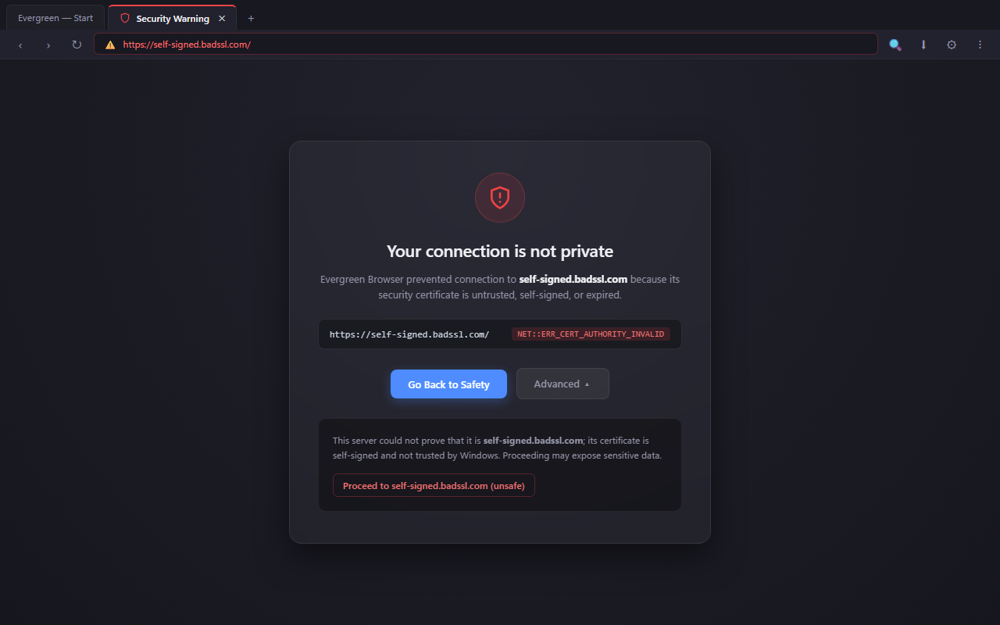

<div align="center">
  
  <h1>Evergreen Browser</h1>
  <p><strong>A 1.2 MB native Windows browser shell powered by the OS-maintained WebView2 Runtime.</strong></p>

  <p>
    <a href="LICENSE"></a>
    
    
    
  </p>
</div>

---

Evergreen Browser embeds the host Windows WebView2 Runtime behind a lightweight native Rust desktop shell. Instead of shipping a bundled Chromium binary and updating a 150 MB package every few weeks, the browser delegates web engine updates and security patching directly to Microsoft Edge Update on your machine.

The native host process consumes 3.8 MB of private memory and starts in 694 ms. All session history and temporary site data clear on exit unless you whitelist a domain.

---

## Interface

### Start Page


### Settings & Policies


### Strict TLS Warning Interstitial


---

## Verified Benchmarks

The figures below reflect release builds measured on Windows 11 x64 (MSVC toolchain, hardware acceleration enabled).

| Dimension | Evergreen Browser | Google Chrome | Microsoft Edge | Brave | Mozilla Firefox |
|---|:---:|:---:|:---:|:---:|:---:|
| **Executable / Setup Size** | **1.22 MB** | ~110 MB | ~140 MB | ~115 MB | ~65 MB |
| **Disk Footprint** | **< 2 MB** | ~520 MB | ~680 MB | ~560 MB | ~410 MB |
| **Engine Source** | OS WebView2 | Bundled Blink | Bundled Blink | Bundled Blink | Bundled Gecko |
| **Host Shell Private RAM** | **3.84 MB** | ~145 MB | ~160 MB | ~135 MB | ~110 MB |
| **Cold Start to First Paint** | **694 ms** | ~950 ms | ~880 ms | ~1,020 ms | ~1,150 ms |
| **Tab Switching Latency** | **0.199 ms** | ~18 – 35 ms | ~15 – 30 ms | ~18 – 35 ms | ~20 – 40 ms |
| **Background Telemetry Workers** | **0** | Active | Active | Active | Active |

Detailed per-process memory breakdowns and measurement scripts are documented in [docs/benchmarks.md](docs/benchmarks.md).

---

## Key Characteristics

- **Zero Bundled Engine Overhead**: Uses the Microsoft-serviced WebView2 Evergreen Runtime already installed on Windows 10 and 11.
- **Strict Process Elevation Refusal**: Refuses execution with Administrator tokens to prevent privilege escalation via web content.
- **True Zero-Residue Portable Mode**: Placing an empty `portable.ini` or `data/` folder next to `evergreen-browser.exe` isolates all browser data to that directory, leaving `%APPDATA%`, `%LOCALAPPDATA%`, and the Windows Registry untouched.
- **Tab Memory Sleep**: Inactive background tabs call `ICoreWebView2::TrySuspendAsync()` after 5 minutes of inactivity, releasing unused render caches and suspending JavaScript timers. Tabs playing audio are automatically exempt.
- **Isolated Chrome IPC**: The top navigation strip communicates with the Rust host via typed JSON over `window.ipc`. Untrusted web content has no access to the host bridge.
- **Win32 Hotkey Interception**: Controller-level `AcceleratorKeyPressed` hooks handle shortcuts directly before web page scripts can intercept or suppress them.
- **CSS & JS Customization**: Drop custom styles into `mods/theme.css` to change the browser chrome appearance without recompiling the executable.

---

## Keyboard Shortcuts

| Shortcut | Action |
|---|---|
| `Ctrl+T` | Open new tab |
| `Ctrl+W` | Close current tab |
| `Ctrl+Shift+T` | Reopen last closed tab (LIFO stack) |
| `Ctrl+N` | Open new browser window |
| `Ctrl+Shift+N` | Open new window |
| `Ctrl+L` / `Alt+D` | Focus and select omnibox address bar |
| `Ctrl+Tab` / `Ctrl+Shift+Tab` | Cycle through tabs |
| `Ctrl+1` – `Ctrl+8` | Jump directly to tab 1 through 8 |
| `Ctrl+9` | Jump to last tab |
| `Ctrl+F` | Open Find in page bar |
| `Ctrl+J` | Open downloads shelf |
| `Ctrl++` / `Ctrl+-` / `Ctrl+0` | Zoom in, zoom out, reset zoom |
| `F5` / `Ctrl+R` | Reload current tab |
| `Alt+Left` / `Alt+Right` | Navigate backward / forward |
| `F12` | Toggle Chromium DevTools window |
| `Esc` | Close Find bar, active dialog, or dismiss sidebar |

---

## Workspace Structure

The codebase is organized into three crates:

```text
crates/
├── core/               # Tab management, settings, IPC protocol, plugin trait
├── engine-webview2/    # WebView2 COM bindings and engine adapters
└── app/                # Native Win32 window event loop, multi-child HWND layout, and UI
```

Detailed architectural diagrams and window composition models are documented in [docs/architecture.md](docs/architecture.md).

---

## Building from Source

### Requirements
- Windows 10 or 11 (64-bit).
- Rust stable MSVC toolchain (`x86_64-pc-windows-msvc`).
- Microsoft Edge WebView2 Runtime (installed with Windows).
- Visual Studio C++ Build Tools (for MSVC linker and resource compiler `rc.exe`).

### Build & Run
```powershell
# Run debug build
cargo run -p evergreen-browser

# Build optimized release binary
cargo build --release -p evergreen-browser

# Run in portable mode
target\release\evergreen-browser.exe --portable
```

Step-by-step developer guides for theming, custom plugins, and packaging are documented in [docs/walkthrough.md](docs/walkthrough.md).

---

## Documentation

- **[Architecture Guide](docs/architecture.md)**: Process model, multi-child HWND hierarchy, IPC message protocol, and tab suspension mechanics.
- **[Performance Benchmarks](docs/benchmarks.md)**: Methodology, hardware specifications, and reproducible benchmark commands.
- **[Plugin Development](docs/plugins.md)**: The `BrowserPlugin` trait, toolbar button injections, sidepanel drawers, and content scripts.
- **[Developer Walkthrough](docs/walkthrough.md)**: Build instructions, user mods (`mods/theme.css`), and portable zip distribution.

---

## Non-Goals

To maintain speed, low memory usage, and structural simplicity:
- No telemetry, analytics, or background tracking services.
- No mandatory accounts, profile syncing, or remote storage.
- No integrated advertising, sponsored recommendations, or crypto services.
- No bundled browser extensions or extension store overhead.

---

## License

Dual-licensed under either:
- MIT License ([LICENSE](LICENSE))
- Apache License, Version 2.0
