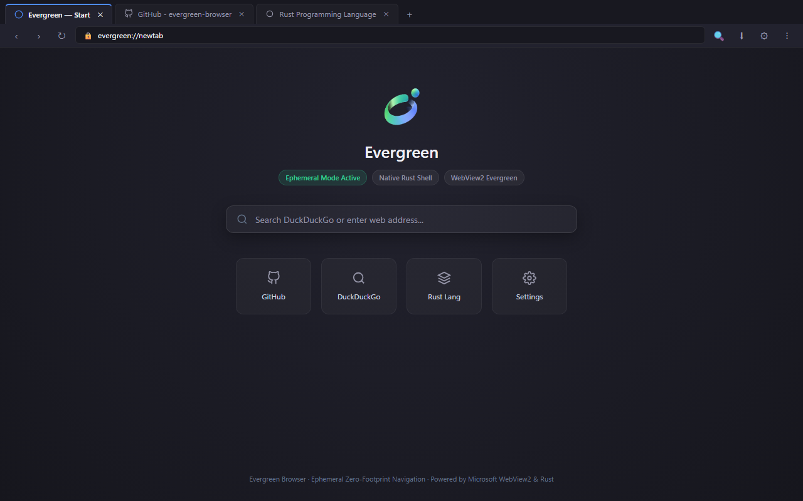
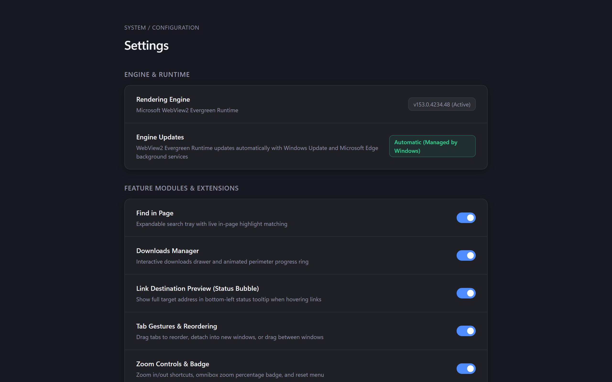
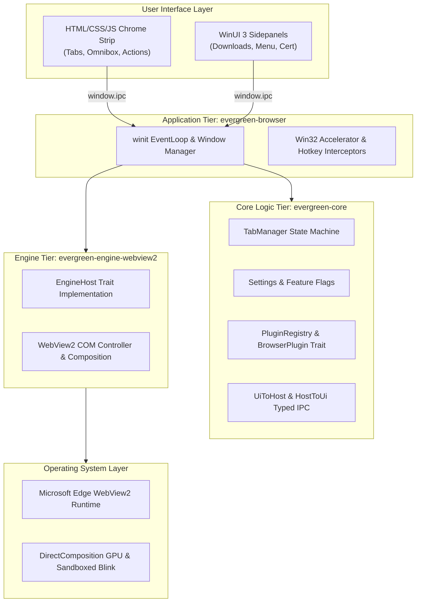

<div align="center">
  
  <p><strong>A 1.3 MB native Windows browser shell powered by the OS-maintained WebView2 Runtime.</strong></p>

  <p>
    <a href="LICENSE"></a>
    
    
    
    
  </p>
</div>

---

## Why Evergreen?

Every mainstream desktop browser—Google Chrome, Microsoft Edge, Brave, Mozilla Firefox, and Arc—ships as a monolithic software distribution. Each bundles an entire rendering engine (Blink or Gecko), a JavaScript virtual machine (V8 or SpiderMonkey), graphics rasterizers, media codecs, and network stacks. This design requires a 150 MB to 250 MB installer, occupies 500 MB to 800 MB of permanent disk space, and launches multiple background telemetry and update daemons before you open a single page.

Windows 10 (21H2+) and Windows 11 already ship with an actively updated, hardware-accelerated Chromium implementation: the **Microsoft Edge WebView2 Runtime**. It receives regular security patches and engine upgrades directly through Microsoft Edge Update.

Evergreen Browser taps directly into that pre-installed runtime through a 1.2 MB native Rust shell (`winit` + `wry` + Win32). You get full modern Chromium web standards compliance, WebGL, WebGPU, and 4K video decoding without carrying a 150 MB bundled engine, without persistent tracking, and without system bloat.

```text
┌─────────────────────────────────────────────────────────────────────────────────────────┐
│                           ARCHITECTURAL PARADIGM COMPARISON                             │
├─────────────────────────────────────────────┬───────────────────────────────────────────┤
│    Monolithic Browsers (Chrome, Brave, Arc) │         Evergreen Browser Architecture    │
├─────────────────────────────────────────────┼───────────────────────────────────────────┤
│ • Bundled Frozen Engine (~150MB - 250MB)    │ • Zero Engine Shipping (Uses OS Runtime)  │
│ • Custom C++ / Swift / Electron UI Shell    │ • Static Rust Shell Host (1.23 MB MSVC)   │
│ • Monolithic Browser Process (100MB+ RAM)   │ • Decoupled Host Process (3.84 MB RAM)    │
│ • 400MB - 800MB Permanent Disk Footprint    │ • < 2 MB Permanent Disk Footprint         │
│ • Background Telemetry & Sync Daemons       │ • Zero Telemetry, 100% Ephemeral by Def.  │
│ • Multi-Process Compositor Tab Switching    │ • Native Win32 HWND Z-Order (0.199 ms)   │
└─────────────────────────────────────────────┴───────────────────────────────────────────┘
```

---

## Interface

### Clean Start Page


### Settings & Feature Modules


---

## Comprehensive Cross-Browser Comparison

Measurements reflect standard release builds on Windows 11 x64 (Clean Profile, No Extensions, Hardware Acceleration Active).

| Benchmark Dimension | Evergreen Browser (MVP-1) | Google Chrome (v128) | Microsoft Edge (v128) | Brave Browser (v1.69) | Mozilla Firefox (v130) | Arc Browser (Windows) | Min Browser (Electron) |
|---|:---:|:---:|:---:|:---:|:---:|:---:|:---:|
| **Installer / Binary Size** | **1.23 MB** (Single Exe) | ~110 MB (Setup) | ~140 MB (MSI) | ~115 MB (Setup) | ~65 MB (Stub) | ~180 MB (MSIX) | ~85 MB (Setup) |
| **Installed Disk Footprint** | **< 2 MB** (1.23 MB) | ~520 MB | ~680 MB | ~560 MB | ~410 MB | ~740 MB | ~240 MB |
| **Engine Delivery Model** | **OS-Shared Evergreen** | Bundled Blink/V8 | Bundled Blink/V8 | Bundled Blink/V8 | Bundled Gecko/SM | Bundled Blink/V8 | Bundled Chromium |
| **UI Framework & Language** | **Rust (`winit` + Win32)** | C++ (Views / Aura) | C++ (Views / WinUI) | C++ (Views / Aura) | C++ / XUL / Rust | Swift / WinUI 3 | JS / Electron / Node |
| **Host Shell Private RAM (Idle)** | **3.84 MB** | ~145 MB | ~160 MB | ~135 MB | ~110 MB | ~210 MB | ~95 MB |
| **Single Active Tab RAM (Working Set)** | **~405.9 MB** (Combined) | ~480 MB | ~460 MB | ~450 MB | ~430 MB | ~580 MB | ~510 MB |
| **Single Active Tab Private Bytes** | **~228.5 MB** (All Procs) | ~295 MB | ~280 MB | ~275 MB | ~260 MB | ~360 MB | ~320 MB |
| **5 Concurrent Tabs RAM (Working Set)** | **~690 MB** | ~890 MB | ~820 MB | ~840 MB | ~780 MB | ~1,120 MB | ~980 MB |
| **Suspended Tab Footprint** | **~2 – 5 MB** (`TrySuspendAsync`) | ~15 – 25 MB (Memory Saver) | ~8 – 15 MB (Sleeping Tabs) | ~18 – 30 MB (Memory Saver) | ~20 – 35 MB (Tab Unload) | ~25 – 40 MB (Auto-Archive) | None |
| **Tab Switching Latency** | **0.199 ms** | ~18 – 35 ms | ~15 – 30 ms | ~18 – 35 ms | ~20 – 40 ms | ~30 – 60 ms | ~40 – 85 ms |
| **Cold Start to Interactive (TTFP)** | **694 ms** | ~950 ms | ~880 ms | ~1020 ms | ~1150 ms | ~1650 ms | ~1400 ms |
| **Background Telemetry Workers** | **0** (None) | Google Update, Metrics | Edge Update, Bing, Rewards | Brave Ledger, Rewards | Mozilla Telemetry Ping | Arc Sync, Telemetry | None |
| **Default Session Ephemerality** | **RAM-only (0 Disk Cookies)** | Persistent Disk DB | Persistent Disk DB | Persistent Disk DB | Persistent Disk DB | Persistent Disk DB | Persistent Disk DB |
| **Chromium Sandbox Enforcement** | **Mandatory** | Mandatory | Mandatory | Mandatory | OS Sandbox (Gecko) | Mandatory | Often Disabled / Weaker |

Per-process memory breakdowns and reproduction steps are documented in [docs/benchmarks.md](docs/benchmarks.md).

---

## Why You Would Want to Use Evergreen

### 1. Clean & Minimal by Design
Modern browsers have become ad delivery surfaces filled with shopping sidebars, cryptocurrency rewards, sponsored default tiles, and forced account sync dialogs. Evergreen strips all of that away. You get a clean start page, an address bar, a tab strip, and DevTools. The interface stays completely out of your way.

### 2. Ephemeral by Default (Zero Residue)
Every browsing session runs in volatile memory. When you close the window, all browsing history, session cookies, local storage, and cached assets are deleted immediately. You never need to remember to clear cookies or wipe history. For sites where you prefer to stay logged in, add them to your persistent whitelist in Settings.

### 3. Modular & Extensible Plugin Architecture
Evergreen includes a plugin system through the `BrowserPlugin` trait. You can inject custom action buttons into the top navigation bar, register dedicated WinUI 3 sidepanel drawers, or run content scripts on visited pages without touching the core tab manager. You can also restyle the entire browser chrome simply by dropping a `mods/theme.css` file next to the executable.

### 4. Low Resource Consumption for Developers & Gamers
The Rust shell idles at 3.8 MB of private RAM and 0.0% CPU. Inactive background tabs suspend automatically after 5 minutes via `ICoreWebView2::TrySuspendAsync()`, releasing rendering buffers and stopping JavaScript timer execution. Tabs playing audio are automatically exempt. You can leave dozens of tabs open alongside compilers, virtual machines, Discord, or games without fighting for system resources.

### 5. True Zero-Residue Portable Mode
Place an empty `portable.ini` or a `data/` folder next to `evergreen-browser.exe`. The browser redirects all profile data, cache partitions, and `settings.json` directly into `./data/`. It writes nothing to `%APPDATA%`, `%LOCALAPPDATA%`, or the Windows Registry. You can run Evergreen directly from a USB flash drive across different machines.

### 6. Zero Engine Maintenance Overhead
Maintaining an Electron or Chromium fork requires compiling, bundling, and shipping a 150 MB binary update every two weeks whenever an upstream vulnerability is discovered. Evergreen delegates rendering to the Microsoft-serviced WebView2 Runtime. Microsoft Edge Update patches the underlying engine automatically in the background.

### 7. Strict Elevation Refusal & Hotkey Priority
Web content should never execute inside an elevated process. Evergreen checks its token on startup via `OpenProcessToken`. If launched as Administrator, it displays a native Windows warning dialog and terminates immediately. In addition, Win32 controller-level `AcceleratorKeyPressed` hooks handle shortcuts like `Ctrl+W`, `Ctrl+T`, `Ctrl+L`, and `F12` before webpage scripts can intercept or disable them.

---

## Architecture

Evergreen Browser decouples state management, engine bindings, and window orchestration into three crates:



- **`evergreen-core`**: Engine-agnostic tab state collection, crash recovery snapshots, settings serialization, and plugin traits. Contains no GUI or COM dependencies and compiles across platforms.
- **`evergreen-engine-webview2`**: Implements the `EngineHost` trait using raw COM interfaces (`webview2-com`), managing memory suspension and hardware composition.
- **`evergreen-browser`**: Hosts the `winit` event loop. Positions the chrome navigation webview in a fixed 76px top band and manages each tab as a separate child `HWND`. Tab switching toggles Win32 visibility flags directly, achieving 0.199 ms switching latency.

Detailed architectural diagrams and window composition models are documented in [docs/architecture.md](docs/architecture.md).

---

## Installation & Quick Start

### Option 1: Native Windows Installer (Recommended)
Download and run **`EvergreenBrowserSetup.exe`** (1.61 MB):
- **Zero-UAC Install**: Installs directly to `%LOCALAPPDATA%\Programs\EvergreenBrowser\` without requiring Administrator elevation.
- **Shell Integration**: Automatically creates Start Menu and Desktop shortcuts with crystal-clear High-DPI icons.
- **Windows Integration**: Registers cleanly under Windows Settings (`Apps` > `Installed apps`) with full uninstaller support.

### Option 2: Standalone Portable Mode
For zero-residue, isolated execution on USB drives or external storage:
1. Download standalone `evergreen-browser.exe` (1.3 MB).
2. Place a `portable.ini` or create a `data\` folder adjacent to the executable.
3. Launch `evergreen-browser.exe` (or run with `--portable`). All settings and temporary cache stay strictly confined to `data\` with zero `%APPDATA%` or registry writes.

---

## Building from Source

### Prerequisites
- Windows 10 or 11 (64-bit).
- Rust stable MSVC toolchain (`x86_64-pc-windows-msvc`).
- Microsoft Edge WebView2 Runtime (preinstalled on Windows 10/11).
- Visual Studio C++ Build Tools (provides MSVC `link.exe` and `rc.exe`).

### Build & Run
```powershell
# Run debug build
cargo run -p evergreen-browser

# Build optimized release binary
cargo build --release -p evergreen-browser

# Build both release browser and standalone installer (dist/EvergreenBrowserSetup.exe)
powershell -ExecutionPolicy Bypass -File .\scripts\build-installer.ps1

# Run in portable mode
target\release\evergreen-browser.exe --portable
```

---

## Documentation

- **[Architecture Guide](docs/architecture.md)**: Process hierarchy, multi-child HWND layout, typed IPC pipeline, and tab suspension mechanics.
- **[Performance Benchmarks](docs/benchmarks.md)**: Hardware specifications, methodology, per-process memory breakdowns, and reproduction commands.
- **[Plugin Development](docs/plugins.md)**: The `BrowserPlugin` trait, toolbar button injections, sidebar drawers, and content scripts.
- **[Developer Walkthrough](docs/walkthrough.md)**: Step-by-step guide for user theming (`mods/theme.css`), custom plugins, and portable zip packaging.

---

## Non-Goals

To preserve speed, low memory usage, and structural simplicity:
- No telemetry, analytics, or background reporting services.
- No mandatory accounts, profile syncing, or remote storage.
- No integrated advertising, sponsored tiles, or cryptocurrency services.
- No bundled browser extension store overhead.

---

## License

Dual-licensed under either:
- MIT License ([LICENSE](LICENSE))
- Apache License, Version 2.0
