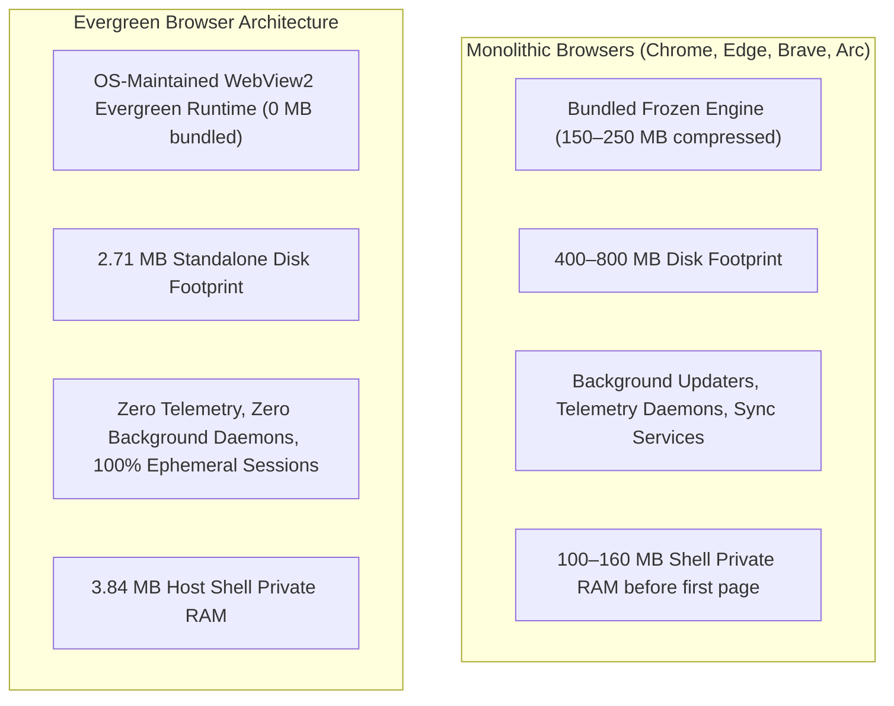
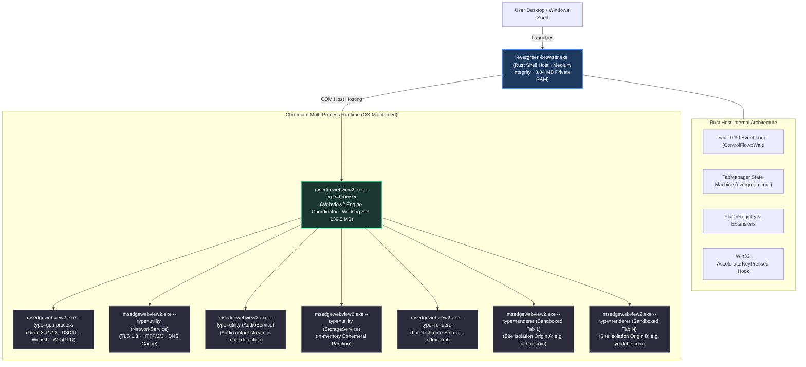
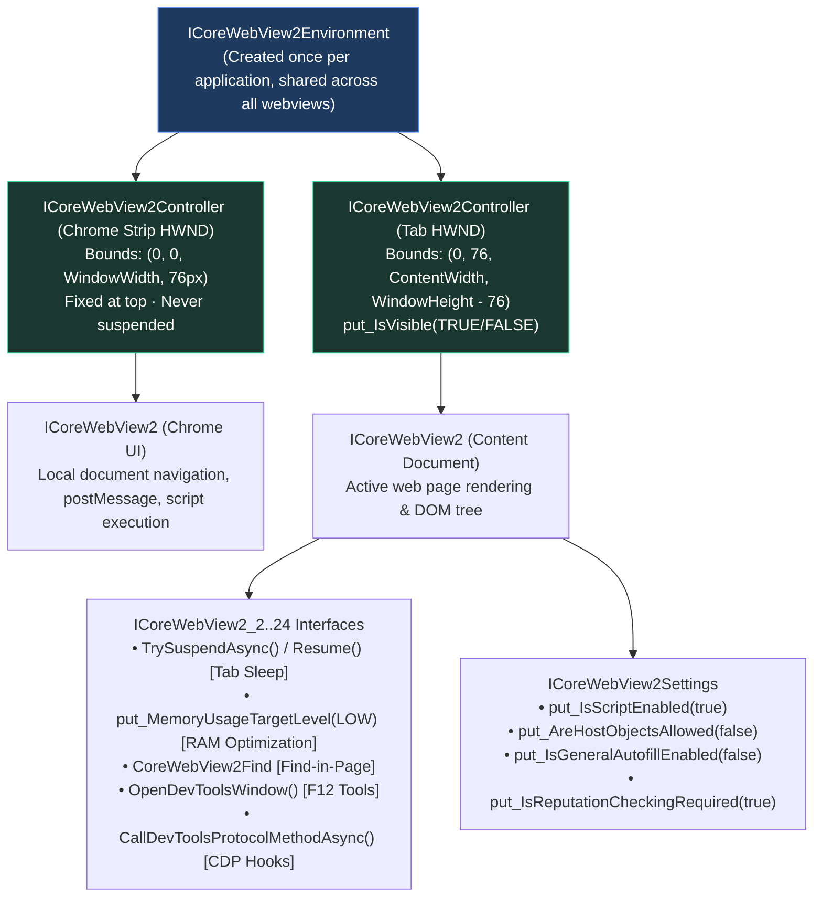
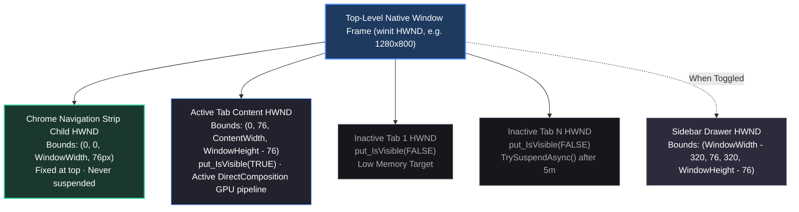
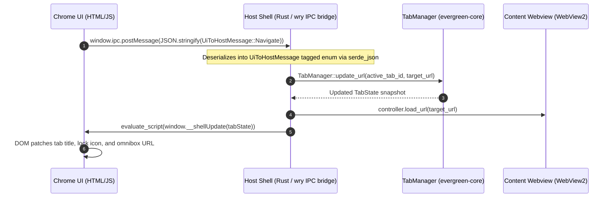
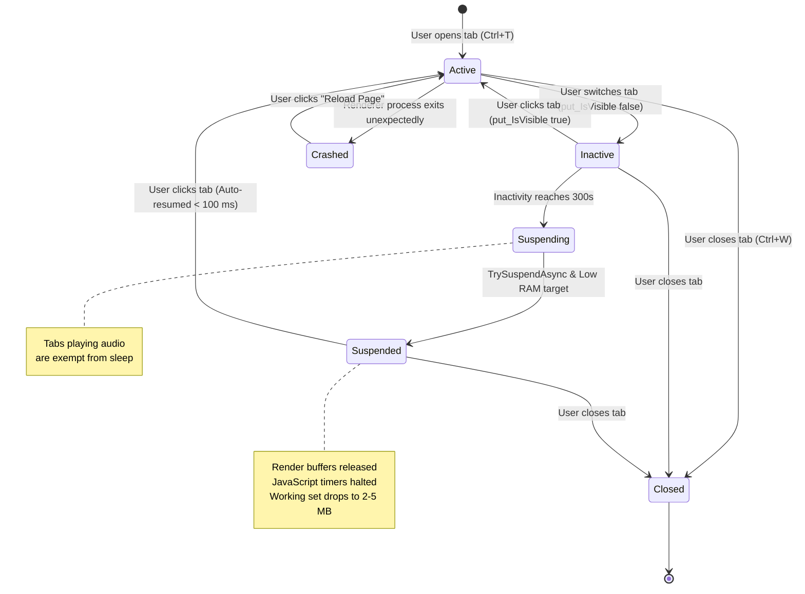
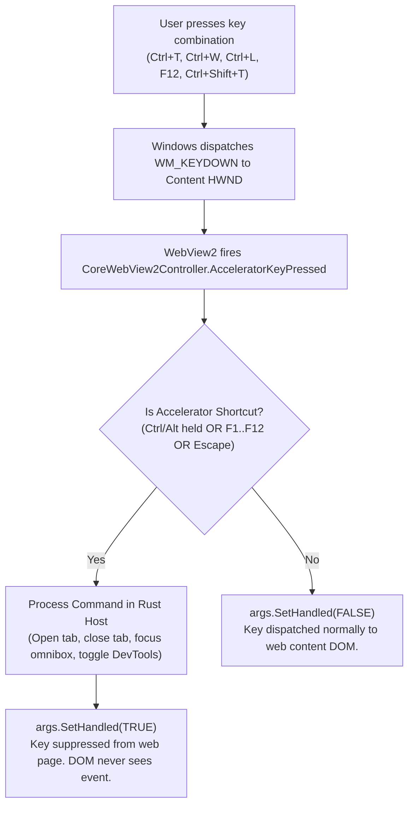
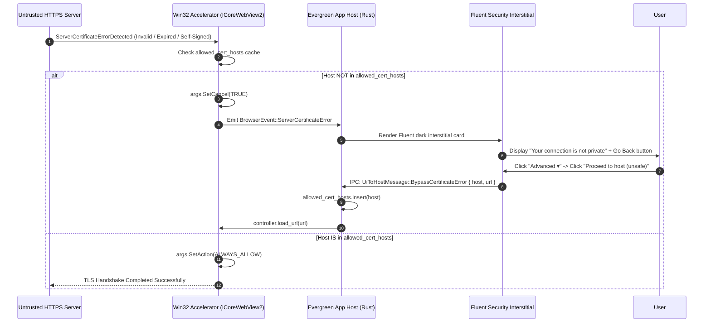
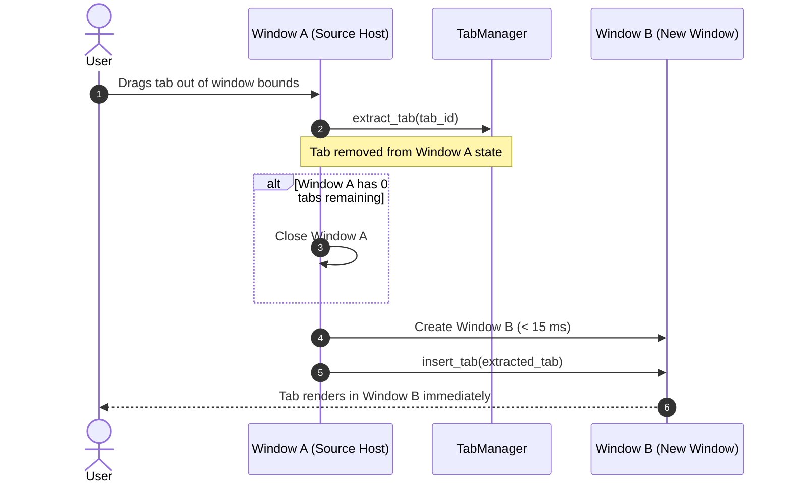
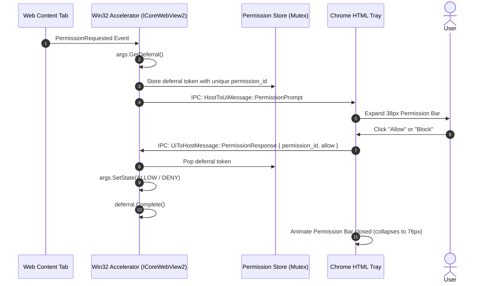

# Detailed Architecture Specification: Evergreen Browser

This document details the architectural design, crate decomposition, process topology, memory lifecycle, Win32 window layout, and security model of Evergreen Browser.

---

## 1. Core Principles & Platform Invariants

Evergreen Browser is a high-performance desktop web browser shell for Windows 10 and 11. It delivers standards-compliant, hardware-accelerated web browsing by driving the host operating system's pre-installed runtime, avoiding the distribution overhead, maintenance cycles, and background telemetry of monolithic browser packages.



### Architectural Invariants

1. **Zero Engine Bundling**: The browser does not package a standalone rendering engine. Instead, it embeds the Microsoft Edge WebView2 Evergreen Runtime already maintained and updated by Windows Update. Upstream Chromium security patches apply automatically at the OS level without local recompilation.
2. **Minimalist Native Shell**: The host shell is written in Rust (`windows-msvc`) and compiles to a static native PE executable (2.71 MB). It requires no external runtimes (.NET, Node.js, V8) for the shell host.
3. **Decoupled Business Core**: Browser business logic (tab state, settings, plugin registration, typed IPC protocols) is strictly isolated in an engine-agnostic crate (`evergreen-core`). Rendering engine bindings are isolated behind an `EngineHost` trait in `evergreen-engine-webview2`.
4. **Mandatory Hardware Acceleration**: The Chromium GPU process runs with DirectComposition and DirectX 11/12 hardware acceleration enabled for rasterization, WebGL, WebGPU, and video decoding.
5. **Renderer Sandboxing**: Chromium site isolation and sandboxing execute with standard least-privilege integrity. Process execution with Administrator tokens is refused at startup.
6. **Ephemeral Sessions by Default**: All cookies, local storage, history, and temporary network caches reside in volatile memory and are cleared when closing the window unless specific origins are whitelisted in Settings.
7. **Silent Native GUI Subsystem**: Release builds execute with `#![cfg_attr(not(debug_assertions), windows_subsystem = "windows")]`, ensuring zero console or terminal window flashes during startup, browsing, and uninstallation.

---

## 2. Workspace Structure & Crate Boundaries

The workspace is organized into four decoupled crates:

```text
evergreen-browser/
├── Cargo.toml                      # Workspace root manifest (LTO, codegen-units=1, panic=abort)
├── crates/
│   ├── core/                       # [Tier 1] Engine-Agnostic Core Logic & Protocols
│   │   ├── Cargo.toml              # Dependencies: serde, serde_json, thiserror, windows (Foundation/Security)
│   │   └── src/
│   │       ├── lib.rs              # Crate root
│   │       ├── engine.rs           # EngineHost trait, EngineInfo, callback definitions
│   │       ├── tabs.rs             # TabManager, TabState, TabId, TabStatus, cross-window migration
│   │       ├── settings.rs         # Settings model, FeatureFlags, partial JSON sync
│   │       ├── plugins.rs          # BrowserPlugin trait, PluginMetadata, PluginRegistry
│   │       ├── env.rs              # Registry scanning, elevation detection, portable mode resolution
│   │       ├── updater.rs          # Silent process execution, GitHub release checking
│   │       └── ipc.rs              # Typed IPC protocols (UiToHostMessage, HostToUiMessage)
│   │
│   ├── engine-webview2/            # [Tier 2] WebView2 Engine Adapter Seam
│   │   ├── Cargo.toml              # Dependencies: evergreen-core, wry, windows, webview2-com
│   │   └── src/
│   │       └── lib.rs              # impl EngineHost for WebView2Host + raw COM adapters
│   │
│   ├── app/                        # [Tier 3] Application Shell & Native Host
│   │   ├── Cargo.toml              # Dependencies: evergreen-core, evergreen-engine-webview2, winit, wry
│   │   ├── ui/
│   │   │   ├── index.html          # Navigation chrome strip (tabs, omnibox, status, menus)
│   │   │   ├── logo.png            # Application brand icon (1254x1254 source)
│   │   │   ├── logo_full.png       # Retina transparent horizontal lockup
│   │   │   ├── logo.b64            # Base64 encoded icon for default favicon & chrome UI
│   │   │   ├── icon.ico            # 7-layer High-DPI Windows icon suite (16x16 to 256x256)
│   │   │   ├── icon_64.rgba        # Raw 64x64 RGBA pixel buffer for window icons
│   │   │   └── icon_32.rgba        # Raw 32x32 RGBA pixel buffer
│   │   └── src/
│   │       ├── main.rs             # Single-process multi-window event loop, tab detach router
│   │       ├── window.rs           # winit Window configuration, frameless handling, hit-testing
│   │       ├── chrome.rs           # Chrome webview controller, IPC message dispatcher
│   │       ├── accelerator.rs      # Win32 COM accelerator hooks, crash containment
│   │       ├── cert.rs             # X.509 certificate parser, thumbprint caching
│   │       ├── home_ui.rs          # Fluent start page template with search bar & privacy badges
│   │       ├── settings_ui.rs      # Full-width settings UI with live runtime version detection
│   │       └── sidebar_ui.rs       # Sidebar drawer (Security info, Menu, Downloads)
│   │
│   └── installer/                  # [Tier 4] Fluent Setup Wizard & Uninstaller
│       ├── Cargo.toml              # Dependencies: evergreen-core, winit, wry, serde_json
│       ├── build.rs                # Windows SDK rc.exe dynamic resolution & PE resource embedding
│       ├── src/
│       │   ├── main.rs             # Multi-step state machine, shortcut manager, process safeguards
│       │   └── installer_ui.rs     # Fluent dark setup & uninstaller HTML/CSS/JS templates
│       └── assets/                 # Staged release binary payload & embedded icons
├── dist/                           # Release distribution directory
│   ├── EvergreenBrowserSetup.exe   # Standalone 4-step setup installer (4.04 MB)
│   └── evergreen-browser.exe       # Standalone portable executable (2.71 MB)
├── docs/                           # Documentation suite
└── scripts/                        # Automation & testing scripts
```

### Dependency Invariants

- **`evergreen-core`** contains zero dependencies on `wry`, `winit`, or rendering engine libraries. It contains pure data structures and logic, fully testable on any platform.
- **`evergreen-engine-webview2`** is the sole crate referencing `webview2-com` and low-level COM interfaces. Replacing this crate allows adapting Evergreen to alternative rendering backends (such as CEF, WebKit, or Servo) without altering application or core logic.
- **`evergreen-browser`** binds the `winit` event loop and native Win32 window handles (`HWND`) to the navigation chrome webview and web content tabs.

---

## 3. Entire Browser System & Process Topology

Evergreen Browser separates the native Rust host process from Chromium's multi-process sandboxing architecture:



### Process Isolation Characteristics

- **Site Isolation per Tab**: Each content tab is hosted as an independent `CoreWebView2` controller. Because `with_related_view` is deliberately avoided, Chromium's Site Isolation places distinct web origins into isolated sandboxed renderer processes. A crash or hang in Tab 1 does not affect Tab N or the Rust host.
- **Private Window Isolation**: Private windows initialize an independent `CoreWebView2ControllerOptions` instance with a unique `ProfileName` and `IsInPrivateModeEnabled = TRUE`. Cookies, cache, and IndexedDB data are strictly separated from normal sessions.

---

## 4. COM Interface Hierarchy

`wry` communicates with the WebView2 Runtime through Microsoft COM interfaces. Where safe abstractions are available, `wry` methods are used; where lower-level engine controls are required, raw COM interfaces are accessed via `wry::WebViewExtWindows::controller()`:



---

## 5. Multi-Child HWND Architecture

Evergreen Browser manages distinct Win32 child windows inside a single top-level `winit` parent window:



### Tab Switching Mechanics

When switching from Tab A to Tab B:
1. Tab A's controller calls `put_IsVisible(FALSE)`.
2. Tab B's controller updates `put_Bounds(...)` to match current viewport dimensions.
3. Tab B calls `put_IsVisible(TRUE)`. If Tab B was suspended, the runtime restores its execution state automatically.
4. Latency benchmark: **0.199 milliseconds**.

When a sidebar drawer (Downloads, Security Info, or Menu) is toggled, the active tab smoothly resizes to `(WindowWidth - 320px)`.

---

## 6. IPC Subsystem & Security Architecture

### Bi-Directional Message Pipeline

Communication between the navigation chrome webview and the Rust host process uses strongly typed JSON messages over `wry`'s IPC bridge:



### Strict IPC Security Constraints

1. **Zero Untrusted Host Objects**: `AreHostObjectsAllowed` is set to `FALSE`. No COM or native C++ objects are injected into the DOM window.
2. **Restricted Message Ingress**: The host accepts action messages (`UiToHostMessage`) **only** from the local chrome navigation webview. Content tabs do not have an IPC message handler attached, preventing untrusted web content from executing host commands.
3. **Structured Serialization**: Data passed from Rust to JavaScript is serialized via `serde_json::to_string()`. Raw string interpolation into `evaluate_script()` is prohibited.
4. **Scheme Sanitization**: Navigation requests received via IPC are validated against an allowlist (`http://`, `https://`, `about:blank`, `evergreen://`). Dangerous schemes (`file://`, `javascript:`, `data:`) are rejected.

---

## 7. Tab Lifecycle & Memory Management

Managing memory across dozens of tabs is handled by combining `TabManager` state transitions with WebView2 memory suspension APIs:



### Memory Suspension Levers

- Background tabs inactive for $\ge 300$ seconds are evaluated for suspension:
  1. Verify `IsDocumentPlayingAudio == FALSE` (audio tabs remain awake).
  2. Call `ICoreWebView2_3::TrySuspendAsync()`.
  3. Call `ICoreWebView2_3::put_MemoryUsageTargetLevel(COREWEBVIEW2_MEMORY_USAGE_TARGET_LEVEL_LOW)`.
  4. Tab state transitions to `TabStatus::Suspended`.
- Memory savings: Working set drops from **~55 MB down to ~2–5 MB** per suspended tab.
- Transparent wake: When the tab is clicked, `put_IsVisible(TRUE)` resumes execution in under 100 ms without reloading from the network.

---

## 8. Win32 Input Dispatch & Accelerator Architecture

In traditional web wrappers, shortcuts like `Ctrl+T` or `Ctrl+W` are captured via JavaScript `keydown` listeners. This fails if a web page calls `stopPropagation()` or if the tab displays a PDF or error interstitial.

Evergreen Browser intercepts shortcuts natively through WebView2's **`AcceleratorKeyPressed`** COM controller event:



This guarantees that browser navigation commands execute reliably regardless of page JavaScript.

---

## 9. Platform Security & Sandbox Integrity

### 9.1 Elevation Refusal (Anti-Root)

WebView2 ignores user policies (`HKCU`) and environment variables when executed inside an elevated process (High Integrity Level). On startup, `evergreen_core::env::is_process_elevated()` inspects the process access token via `OpenProcessToken`. If elevated, the shell displays a native security warning and terminates, preventing accidental sandbox bypass.

### 9.2 Prohibition of Insecure Flags

Command-line flags that weaken security—such as `--no-sandbox`, `--disable-gpu`, `--disable-web-security`, and `--allow-file-access-from-files`—are strictly prohibited. Automated tests enforce that these flags never appear in release code.

### 9.3 Strict TLS Interstitial & Host-Level Certificate Bypass

When `ServerCertificateErrorDetected` fires, navigation is blocked immediately and a Fluent dark security interstitial is rendered:



---

## 10. Multi-Window Host & Tab Detach

To provide fast window creation and tab detachment without multi-process spin-up latency:

- A single Rust host process manages multiple top-level `winit::Window` instances stored in `HashMap<WindowId, WindowContext>`.
- Windows share a common `ICoreWebView2Environment` and process pool. Creating a new window takes **< 15 ms**.



- When a tab is dropped onto an existing window, `extract_tab()` and `insert_tab()` transfer the tab state seamlessly.
- Closing the final tab in a window automatically closes that window.

---

## 11. Asynchronous Site Permission Lifecycle

WebView2 permission requests (Microphone, Camera, Geolocation, Notifications) are handled asynchronously via deferral tokens:



---

## 12. Extensibility Tiers

Evergreen Browser provides four extensibility tiers:

1. **Tier 1 (CSS Theming)**: Restyle the browser chrome by placing a `mods/theme.css` file adjacent to `evergreen-browser.exe`. Custom styles load automatically at startup.
2. **Tier 2 (Configuration Toggles)**: Fine-grained settings in `settings.json` (search providers, sleep timers, download preferences, feature flags).
3. **Tier 3 (Rust `BrowserPlugin` Trait)**: Implement `BrowserPlugin` in `crates/core/src/plugins.rs` to register custom toolbar buttons, sidepanels, content scripts, and IPC handlers:
   ```rust
   pub trait BrowserPlugin: Send + Sync {
       fn metadata(&self) -> PluginMetadata;
       fn is_enabled(&self, settings: &Settings) -> bool;
       fn toolbar_item_html(&self) -> Option<&'static str> { None }
       fn sidepanel_view(&self) -> Option<(&'static str, &'static str)> { None }
       fn content_script(&self) -> Option<&'static str> { None }
       fn handle_ipc(&self, action: &str, payload: &serde_json::Value) -> Option<serde_json::Value> { None }
   }
   ```
4. **Tier 4 (Engine Swapping via `EngineHost`)**: Implement the `EngineHost` trait in `crates/core/src/engine.rs` to evaluate alternative rendering engines without modifying core tab logic.
