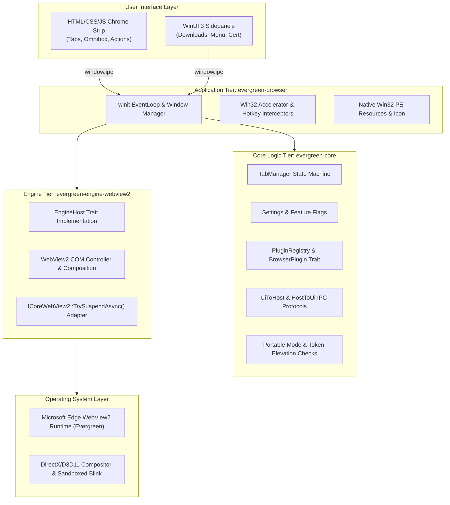
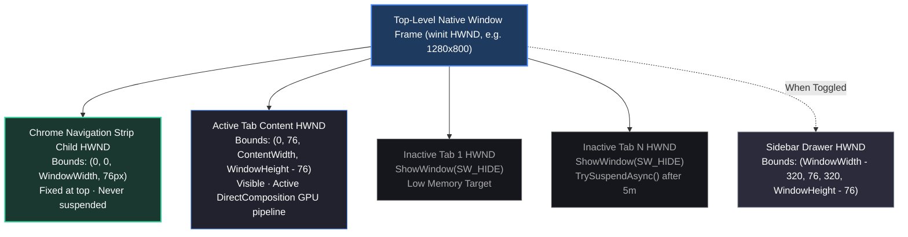
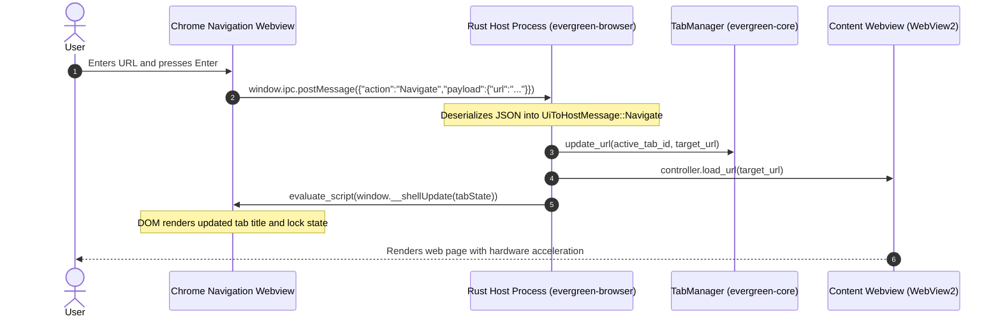

# Architecture Overview

Evergreen Browser embeds the host Windows WebView2 Runtime behind a native Rust desktop shell. Instead of shipping a bundled 150 MB+ Chromium binary, the browser delegates web engine updates and security patching directly to Microsoft Edge Update on the user's operating system.

---

## 1. Crate Boundaries & Dependencies

The workspace separates business logic, engine bindings, and window management into three decoupled tiers:



### `evergreen-core`
Contains all data structures, collections, and state machines:
- **`TabManager`**: Pure in-memory tab state collection, active tab transitions, and closed-tab restoration history.
- **`Settings`**: Configuration struct, feature flags, and partial JSON patch logic.
- **`BrowserPlugin`**: Extension trait for custom toolbars, sidebars, content scripts, and IPC message handlers.
- **`UiToHostMessage` & `HostToUiMessage`**: Strongly typed serde enums defining the IPC protocol.
- **`env`**: Zero-residue portable mode path resolution and token elevation checks.

`evergreen-core` does not depend on `wry`, `winit`, or `windows`. It compiles and runs unit tests on any platform.

### `evergreen-engine-webview2`
The sole crate in the workspace referencing COM interfaces and `webview2-com`. It implements the `EngineHost` trait and manages engine-level calls such as memory suspension and hardware composition.

### `evergreen-browser` (`app`)
The native application binary:
- Initializes the `winit` event loop.
- Manages child window handles (`HWND`) for the top navigation bar, sidebars, and active content tabs.
- Routes user keystrokes through controller-level `AcceleratorKeyPressed` hooks.
- Sets PE subsystem headers (`windows_subsystem = "windows"`) to ensure silent GUI execution without console pop-ups.

---

## 2. Multi-Child Window Layout

Evergreen Browser uses native Win32 child windows inside a single top-level `winit` window frame:



When switching tabs, the host toggles Win32 visibility flags directly (`ShowWindow(SW_SHOW)` / `ShowWindow(SW_HIDE)`). This avoids compositor surface recreation and keeps tab switching latency under 0.2 milliseconds.

When a sidebar opens (Downloads, Security, or Menu), the active content webview resizes smoothly to `(WindowWidth - 320px)`.

---

## 3. IPC Message Pipeline

All communication between the HTML navigation strip and the Rust host uses typed JSON messages:



Content web pages never have access to `window.ipc`. The message bridge is bound exclusively to the local chrome navigation webview.

---

## 4. Tab Sleep & Memory Lifecycle

Inactive tabs enter low-memory states automatically to prevent background resource hogging:

```mermaid
stateDiagram-v2
    [*] --> Active: User opens tab
    Active --> Inactive: User switches to another tab
    Inactive --> Active: User clicks tab / presses shortcut

    Inactive --> Suspending: Inactive for 300 seconds (5 min)
    note right of Suspending: Audio playing tabs are exempt
    
    Suspending --> Suspended: Call ICoreWebView2::TrySuspendAsync()
    note right of Suspended: Target memory level set to LOW<br>Render caches released<br>JavaScript timers halted

    Suspended --> Active: User clicks tab
    note right of Active: State restored immediately<br>No network document reload
```

- Inactive background tabs invoke `ICoreWebView2::TrySuspendAsync()` after 5 minutes without user interaction.
- The engine sets the target memory usage level to `LOW`, flushing unused render caches and suspending JavaScript timers.
- Tabs playing audio are exempt from suspension.
- Clicking a suspended tab restores execution immediately without reloading the network document.
