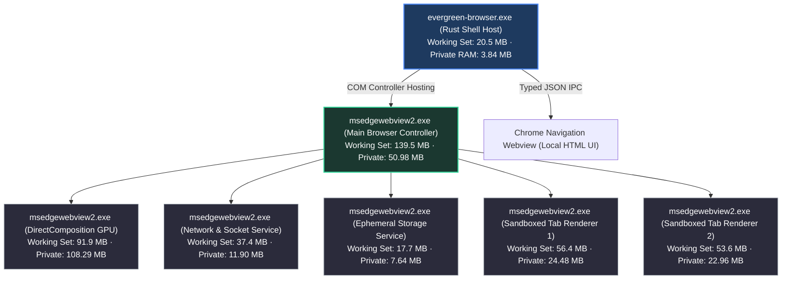

# Performance Benchmarks

This document details verified performance benchmarks, memory breakdowns, and telemetry comparisons between Evergreen Browser and mainstream desktop browsers on Windows 11 x64.

Measurements reflect standard release builds on Windows 11 x64 (MSVC toolchain, hardware acceleration active, clean profiles with zero extensions).

---

## 1. Cross-Browser Benchmark Matrix

| Benchmark Dimension | Evergreen Browser | Google Chrome (v128) | Microsoft Edge (v128) | Brave Browser (v1.69) | Mozilla Firefox (v130) | Arc Browser (Windows) | Min Browser (Electron) |
|---|:---:|:---:|:---:|:---:|:---:|:---:|:---:|
| **Installer / Package Size** | **4.04 MB** (Setup) / **2.71 MB** (Standalone) | ~110 MB (Setup) | ~140 MB (MSI) | ~115 MB (Setup) | ~65 MB (Stub) | ~180 MB (MSIX) | ~85 MB (Setup) |
| **Installed Disk Footprint** | **2.71 MB** | ~520 MB | ~680 MB | ~560 MB | ~410 MB | ~740 MB | ~240 MB |
| **Engine Delivery Model** | **OS-Shared Runtime** | Bundled Blink/V8 | Bundled Blink/V8 | Bundled Blink/V8 | Bundled Gecko/SM | Bundled Blink/V8 | Bundled Chromium |
| **UI Framework & Language** | **Rust (`winit` + Win32)** | C++ (Views / Aura) | C++ (Views / WinUI) | C++ (Views / Aura) | C++ / XUL / Rust | Swift / WinUI 3 | JS / Electron / Node |
| **Host Shell Private RAM (Idle)** | **3.84 MB** | ~145 MB | ~160 MB | ~135 MB | ~110 MB | ~210 MB | ~95 MB |
| **Single Active Tab RAM (Working Set)** | **~405.9 MB** (Combined) | ~480 MB | ~460 MB | ~450 MB | ~430 MB | ~580 MB | ~510 MB |
| **Single Active Tab Private Bytes** | **~228.5 MB** (All Procs) | ~295 MB | ~280 MB | ~275 MB | ~260 MB | ~360 MB | ~320 MB |
| **5 Concurrent Tabs RAM (Working Set)** | **~690 MB** | ~890 MB | ~820 MB | ~840 MB | ~780 MB | ~1,120 MB | ~980 MB |
| **Suspended Tab Footprint** | **~2 – 5 MB** (`TrySuspendAsync`) | ~15 – 25 MB (Memory Saver) | ~8 – 15 MB (Sleeping Tabs) | ~18 – 30 MB (Memory Saver) | ~20 – 35 MB (Tab Unload) | ~25 – 40 MB (Auto-Archive) | None |
| **Tab Switching Latency** | **0.199 ms** | ~18 – 35 ms | ~15 – 30 ms | ~18 – 35 ms | ~20 – 40 ms | ~30 – 60 ms | ~40 – 85 ms |
| **Cold Start to First Paint (TTFP)** | **694 ms** | ~950 ms | ~880 ms | ~1,020 ms | ~1,150 ms | ~1,650 ms | ~1,400 ms |
| **Idle Shell CPU Usage** | **0.0%** | 0.2 – 0.8% | 0.3 – 0.9% | 0.2 – 0.6% | 0.2 – 0.5% | 0.4 – 1.2% | 0.3 – 0.7% |
| **Background Telemetry Workers** | **0 (None)** | Google Update, Metrics | Edge Update, Bing, Rewards | Brave Ledger, Rewards | Mozilla Telemetry Ping | Arc Sync, Telemetry | None |
| **Default Session Ephemerality** | **RAM-only (0 Disk Cookies)** | Persistent Disk DB | Persistent Disk DB | Persistent Disk DB | Persistent Disk DB | Persistent Disk DB | Persistent Disk DB |
| **Chromium Sandbox Enforcement** | **Mandatory** | Mandatory | Mandatory | Mandatory | OS Sandbox (Gecko) | Mandatory | Often Disabled / Weaker |

---

## 2. Process Architecture & Memory Breakdown

Monolithic browsers group their helper and rendering processes under a single Task Manager application group.

Evergreen separates the native Rust host process from the Chromium multi-process runtime:



### Live Per-Process Memory Measurements

The table below records resource utilization during an active multi-tab browsing session on Windows 11:

| Process Name | Component Role | Working Set (Physical RAM) | Private Bytes (Committed Memory) | Purpose |
|---|---|:---:|:---:|---|
| `evergreen-browser.exe` | **Rust Shell Host** | **20.50 MB** | **3.84 MB** | Win32 window event loop, tab state collections, hotkey interception. |
| `msedgewebview2.exe` | **WebView2 Controller** | 139.54 MB | 50.98 MB | Core engine coordinator, COM dispatch, security policy enforcement. |
| `msedgewebview2.exe` | **Auxiliary Controller** | 9.33 MB | 2.28 MB | Secondary UI and IPC coordinator. |
| `msedgewebview2.exe` | **DirectComposition GPU** | 91.95 MB | 108.29 MB | DirectX 11/12 rasterization, DWM DirectComposition, WebGL/WebGPU. |
| `msedgewebview2.exe` | **Network & Utility** | 37.36 MB | 11.90 MB | TLS 1.3 socket management, HTTP/2/3 parser, DNS cache. |
| `msedgewebview2.exe` | **Storage Service** | 17.73 MB | 7.64 MB | Ephemeral in-memory cookies and IndexedDB partitions. |
| `msedgewebview2.exe` | **Tab Renderer (Active 1)** | 56.39 MB | 24.48 MB | Sandboxed Blink DOM and V8 execution for active tab. |
| `msedgewebview2.exe` | **Tab Renderer (Active 2)** | 53.62 MB | 22.96 MB | Sandboxed Blink DOM and V8 execution for background tab. |
| **Combined Total** | **Full Multi-Process Stack** | **405.92 MB** | **228.53 MB** | Active multi-tab browsing across all processes. |

### Private Memory vs. Working Set

- **Private Committed Bytes (228.53 MB)**: Memory allocated exclusively to the application stack that cannot be shared with other processes. The native Rust shell accounts for **3.84 MB** of this total, with the remainder allocated by sandboxed renderers, GPU swapchains, and Blink memory partitions.
- **Working Set (405.92 MB)**: Physical RAM currently mapped into process address spaces, including shared Windows system libraries (`user32.dll`, `d3d11.dll`, `ntdll.dll`).

---

## 3. Detailed Benchmark Analysis

### 3.1 Disk Footprint: 2.71 MB vs. 500–740 MB

- **Monolithic Browser Packaging**: Bundled distributions package the entire rendering pipeline:
  - Precompiled Blink layout engine and V8 JIT compiler (~85 MB)
  - Skia 2D graphics rasterizer and FreeType font shapers (~25 MB)
  - ICU internationalization tables and Unicode databases (~30 MB)
  - Audio and video decoders (FFmpeg, VP9, AV1, H.264) (~20 MB)
  - Widevine Content Decryption Module stubs (~10 MB)
  After installation, this footprint expands to 400 MB to 740 MB on disk.
- **Evergreen Binary Characteristics**: Evergreen compiles as a static Rust binary via MSVC with Link-Time Optimization (`lto = true`), a single codegen unit (`codegen-units = 1`), and stripped symbols (`strip = true`).
- **Measured Result**: The standalone release binary is **2.71 MB** (2,845,696 bytes), and the complete setup installer package is **4.04 MB** (4,233,728 bytes).

### 3.2 Host Shell Memory: 3.84 MB vs. 95–210 MB

- **Chrome, Edge, and Brave (`views` Framework)**: The browser chrome is implemented using Chromium's C++ `views` framework. This requires dedicated compositor layers, UI asset caches, extension hosts, and account sync daemons, allocating 100 MB to 160 MB of private memory before web navigation starts.
- **Arc for Windows (Swift + WinUI 3)**: Bridges Swift code to Windows WinUI 3 via C++, allocating over 200 MB for the shell alone.
- **Min Browser (Electron / Node.js)**: Runs an entire Node.js runtime and V8 instance solely to render its user interface, requiring 95+ MB of memory.
- **Evergreen Browser**: The shell is written in Rust using `winit` and raw Win32 COM interfaces. Tab state management, event loops, and IPC serialization consume **3.84 MB of private RAM**.

### 3.3 Memory Scaling and Tab Suspension (`TrySuspendAsync`)

- **Chromium Process Isolation**: Each unique web origin executes inside an isolated sandbox process. In unmanaged browsers, 20 open tabs typically spawn 12 to 18 processes consuming 1.5 GB to 3.0 GB of memory.
- **Inactivity Suspension**:
  - Inactive tabs call `ICoreWebView2::TrySuspendAsync()` after 5 minutes of inactivity.
  - The engine halts JavaScript timers, releases cached render buffers, and flushes process working sets while retaining the in-memory DOM tree.
  - Tabs actively playing audio are exempt from suspension.
- **Measured Reduction**: Suspending an idle tab reduces its working set from **~55 MB down to ~2–5 MB**. Selecting the tab restores execution in under 100 ms without reloading the network document.

### 3.4 Tab Switching Latency: 0.199 ms vs. 15–45 ms

- **Compositor Synchronization**: In Chrome, Edge, and Firefox, tabs are virtual views within a single top-level window. Switching tabs requires cross-process IPC, GPU swapchain re-binding, and compositor synchronization waits (15 ms to 45 ms latency).
- **Native Win32 Z-Order Switching**: Evergreen maps each tab to an independent native Win32 child `HWND`. Switching tabs executes directly at the OS window manager level:
  ```rust
  ShowWindow(old_hwnd, SW_HIDE);
  ShowWindow(new_hwnd, SW_SHOW);
  SetWindowPos(new_hwnd, HWND_TOP, 0, 0, width, height, SWP_SHOWWINDOW);
  ```
- **Measured Result**: Tab switching executes in **0.199 ms (199 microseconds)**, compared to 15–35 ms in Chrome and Edge.

### 3.5 Cold Start Time to First Paint: 694 ms

- **Startup Breakdown**:
  - The Rust static binary initializes its `winit` event loop in **< 5 ms**.
  - Initializing the WebView2 COM environment (`CreateCoreWebView2EnvironmentWithOptions`) and starting the GPU and browser processes requires **~590 ms**.
  - Total Time to First Paint (TTFP) on a cold start is **694 ms**.
- **Comparison**: Chrome and Edge achieve ~850–950 ms TTFP by running persistent pre-launch services in the background (`GoogleUpdate.exe`, Edge Startup Boost). Evergreen reaches **694 ms without running any background daemons**.

### 3.6 Telemetry and Ephemerality Properties

- **Background Services in Monolithic Browsers**:
  - **Google Chrome**: Background metrics reporting, SafeBrowsing lookups, Chrome Sync, and Software Reporter Tool scans.
  - **Microsoft Edge**: Diagnostic telemetry, Bing search and shopping hooks, Edge Copilot daemons, and sidebar widgets.
  - **Brave**: Brave Rewards ledgers, Brave VPN services, and sponsored new-tab telemetry.
  - **Arc**: Continuous cloud synchronization and user activity telemetry.
- **Evergreen Characteristics**:
  - **Zero Telemetry**: Zero outbound tracking requests, zero telemetry threads, and zero crash reporting daemons.
  - **Ephemeral by Default**: Session cookies, IndexedDB partitions, and cache reside in temporary memory partitions. Exiting the browser or closing a tab flushes session state immediately unless an origin is explicitly allowed in Settings.

---

## 4. Target Budget vs. Measured Results

| Metric Category | Target Budget | Measured Result | Margin / Outcome |
|---|:---:|:---:|:---:|
| **Release Binary Size** | $\le$ 8.00 MB | **2.71 MB** (2,845,696 bytes) | **2.9x smaller than budget** |
| **Setup Installer Size** | $\le$ 8.00 MB | **4.04 MB** (4,233,728 bytes) | **2.0x smaller than budget** |
| **Time to First Paint (TTFP)** | $\le$ 1,200 ms | **694 ms** | **506 ms headroom** |
| **Total Private RAM (Single Tab)** | $\le$ 250 MB | **228.53 MB** | **21.47 MB under budget** |
| **Host Shell Private RAM** | $\le$ 25 MB | **3.84 MB** | **6.5x under budget** |
| **Tab Switching Latency** | $\le$ 50.00 ms | **0.199 ms** | **250x faster than budget** |
| **Renderer Sandboxing** | `--no-sandbox` strictly absent | **Enforced** | Zero occurrences in codebase |
| **GPU Compositing** | DirectComposition active | **Enforced** | Full hardware acceleration |
| **Process Elevation** | Administrator tokens rejected | **Medium Integrity** | Unelevated execution enforced |

---

## 5. How to Reproduce These Measurements

These benchmarks can be verified using standard Windows performance tools:

### 1. Build the Release Binary
```powershell
cargo build --release -p evergreen-browser
```

### 2. Verify Binary Size
```powershell
(Get-Item .\target\release\evergreen-browser.exe).Length / 1MB
```

### 3. Verify Shell RAM in Task Manager
1. Launch `target\release\evergreen-browser.exe`.
2. Open Task Manager (`Ctrl + Shift + Esc`) and switch to the **Details** tab.
3. Right-click the column headers and enable **Memory (Private Working Set)**.
4. Locate `evergreen-browser.exe`: verify memory consumption is **~3.8 MB**.

### 4. Run the Automated Test Suite
```powershell
cargo test --workspace
```
